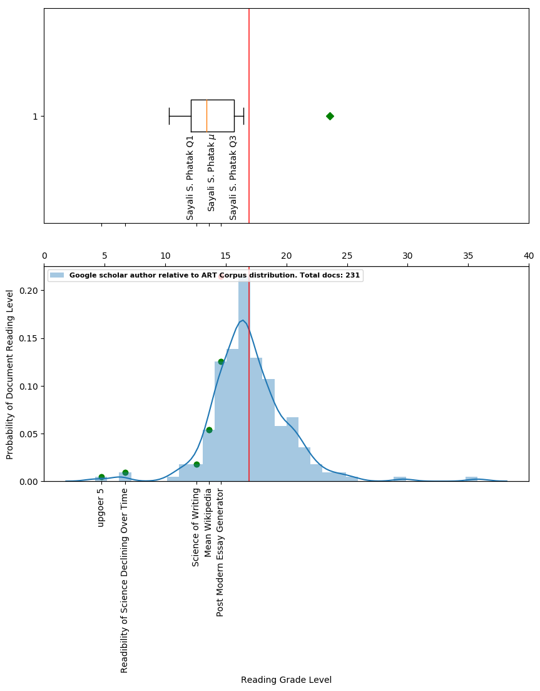
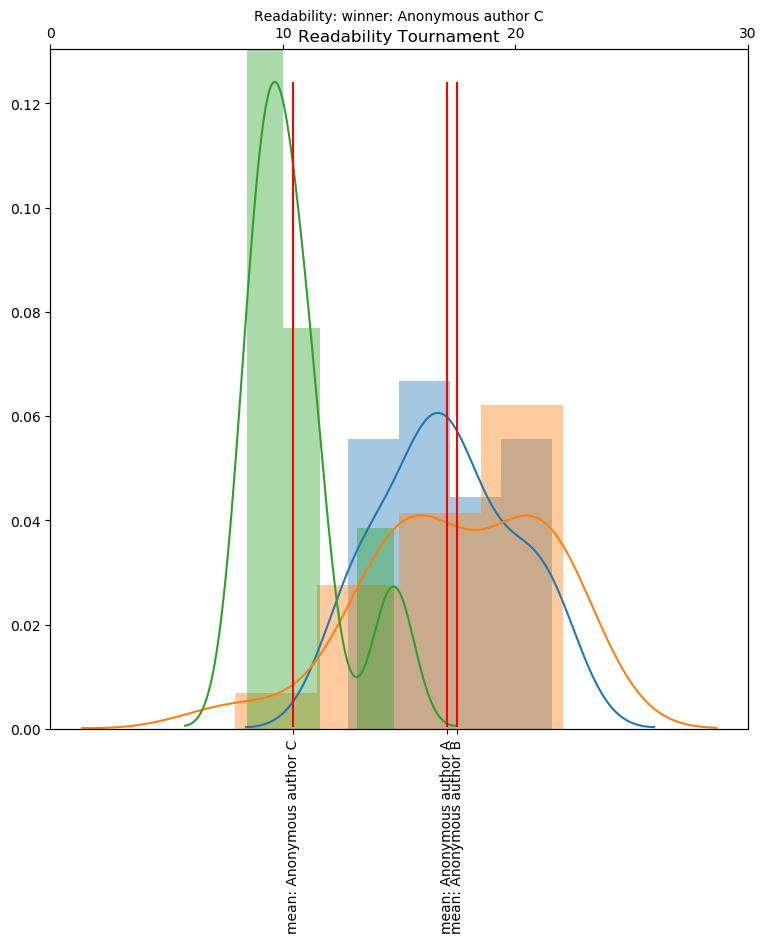

title: 'Exploring the Readability of Scientific and Non-scientific Sources'
		
tags:
  - readability
  - science communication
  - science writing

authors:
  - name: Russell Jarvis
    affiliation: PhD Candidate Neuroscience, Arizona State University
  - name: Patrick McGurrin
    affiliation: National Institute of Neurological Disorders and Stroke, National Institutes of Health
  - name: Shivam Bansal
    affiliation: Senior Data Scientist, H2O.ai
  - name: Bradley G Lusk
    affiliation: Science The Earth; Mesa, AZ 85201, USA
    
date: 20 October 2019

bibliography: paper.bib

# Summary
To ensure that writing is accessible to the general population, authors must consider the length of written text, as well as sentence structure, vocabulary, and other language features [@Kutner:2006]. While popular magazines, newspapers, and other outlets purposefully cater language for a wide audience, there is a tendency for academic writing to use more complex, jargon-heavy language [@Plavén-Sigray:2017]. 

In the age of growing science communication, this tendency for scientists to use more complex language can carry over when writing in more mainstream media, such as blogs and social media. This can make public-facing material difficult to comprehend, undermining efforts to communicate scientific topics to the general public.

While readability tools, such as Readable (https://www.webfx.com/tools/read-able/) and Upgoer5 (https://splasho.com/upgoer5/) currently exist to report on readability of text, they report the complexity of only a single document. In addition, these tools do not address complexity in a more academic-type setting.

To address this, we created a tool that uses a data-driven approach to provide authors with insights into the readability of the entirety of their published scholarly work with regard to other text repositories. The tool first quantifies existing text repositories with varying complexity, and subsequently uses this output as a reference to show how the readability of user-selected written work compares to these other known resources. 

This tool also introduces one additional feature for readability comparison and improvement. It allows the entry of two author names to enable a competition as to whose text has the lowest average readability score. Public competitions can often incentivize good practices, and this may be a fun and interactive tool to help improve readability scores over time.

Ultimately, this tool will expand upon current readability metrics by computing a more detailed and comparative look at the complexity of written text. We hope that this will allow scientists and other experts to better monitor the complexity of their writing relative to other text types, leading to the creation of more accessible online material. And with hope, an improved global communication and understanding of complex topics.

# Methods

### Text Analysis Metrics
We built a web-scraping and text analysis infrastructure by extending many existing Free and Open Source (FOS) tools, including Google Scrape, Beautiful Soup, and Selenium.

We first query a number of available text repositories with varying complexity:

| Text Source | Mean Complexity | Description |
|----------|----------|:-------------:|
| Upgoer 5                            | 6   | library using only the 10,000 most commonly occurring English words |
| Wikipedia                               | 14.9 | free, popular, crowdsourced encyclopedia   |
| Post-Modern Essay Generator (PMEG)  | 16.5 | generates output consisting of sentences that obey the rules of written English, but without restraints on the semantic conceptual references   |
| Art Corpus                       | 18.68  | library of scientific papers published in The Royal Society of Chemistry |

Entering an author's name (or two authors for the competition plot) by the user begins a query through Google Scholar, returning the scraped results from articles containing the author's name(s). 

The Flesch-Kincaid readability score [@Kincaid:1975] - the most commonly used metric to assess readability - is then used to quantify the complexity of all items.

### Reproducibility
A Docker file and associated container together serve as a self-documenting and portable software environment clone to ensure reproducibility given the hierarchy of software dependencies.

# Output
Data are available here: [Open Science Framework data repository](https://osf.io/dashboard).

## Contextualized Readability Output
The generated plot for contextualized readability information is a histogram binned by readability score, initially populated exclusively by the ART corpus [@Soldatova:2007] data. We use this data because it is a pre-established library of scientific papers. The readability of ART Corpus has also been shown to be comparable to that of other scientific journals [2].

The mean readability scores of Upgoer5 [@Kuhn:2016], Wikipedia, and PMEG [@Bulhak:1996] libraries are labeled on the plot as single data points to contextualize the complexity of the ART corpus data with other text repositories of known complexity. 

We also include mean readability scores from two scholarly reference papers, Science Declining Over Time [@Kutner:2006] and Science of Writing [@Gopen:1990], which discuss writing to a broad audience in an academic context. We use these to demonstrate the feasibility of discussing complex content using more accessible language.

Lastly, the mean reading level of the entered author's work is displayed as a boxplot that has is shares an x-axis with the ART-corpus distribution data. The boxplot depicts mean, and the first and third quartiles of the authors specific works. The box plot enables the viewer of the report to get a sense of underlying variance in the specific authors work, relative to variance in the ART-corpus. We also display single data points for the maximum and minimum scores. Thus, the resulting graph displays the mean writing complexity of the entered author against a distribution of ART corpus content as well as these other text repositories of known complexity.

## Competition Output
The three-author competition plot displays two distributions which display the readability distribution of only the author's written work, as scraped and analyzed from Google Scholar. Vertical lines are used to plot the mean readability value for each author. Anonymous authors A and B, are co-authors that publish in the same field, thus their readability scores should be closely matched, as their score will be derived from some mutual documents. Anonymous author C, publishes in an unrelated field and does not co-author with authors A and B.

# References
